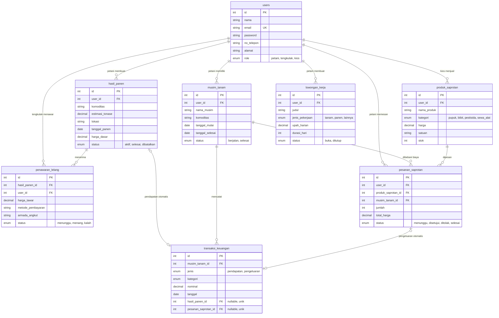

# ERD: Platform Web Pertanian

```mermaid
erDiagram
    users ||--o{ hasil_panen : "petani membuat"
    users ||--o{ penawaran_lelang : "tengkulak menawar"
    users ||--o{ musim_tanam : "petani memiliki"
    users ||--o{ produk_saprotan : "kios menjual"
    users ||--o{ pesanan_saprotan : "petani memesan"
    users ||--o{ lowongan_kerja : "petani membuat"

    hasil_panen ||--o{ penawaran_lelang : "menerima"
    hasil_panen |o--o| transaksi_keuangan : "pendapatan otomatis"

    musim_tanam ||--o{ transaksi_keuangan : "mencatat"
    musim_tanam ||--o{ pesanan_saprotan : "dibebani biaya"

    produk_saprotan ||--o{ pesanan_saprotan : "dipesan"
    pesanan_saprotan |o--o| transaksi_keuangan : "pengeluaran otomatis"

    users {
        int id PK
        string nama
        string email UK
        string password
        string no_telepon
        string alamat
        enum role "petani, tengkulak, kios"
    }
    hasil_panen {
        int id PK
        int user_id FK
        string komoditas
        decimal estimasi_tonase
        string lokasi
        date tanggal_panen
        decimal harga_dasar
        enum status "aktif, selesai, dibatalkan"
    }
    penawaran_lelang {
        int id PK
        int hasil_panen_id FK
        int user_id FK
        decimal harga_tawar
        string metode_pembayaran
        string armada_angkut
        enum status "menunggu, menang, kalah"
    }
    musim_tanam {
        int id PK
        int user_id FK
        string nama_musim
        string komoditas
        date tanggal_mulai
        date tanggal_selesai
        enum status "berjalan, selesai"
    }
    transaksi_keuangan {
        int id PK
        int musim_tanam_id FK
        enum jenis "pendapatan, pengeluaran"
        enum kategori
        decimal nominal
        date tanggal
        int hasil_panen_id FK "nullable, unik"
        int pesanan_saprotan_id FK "nullable, unik"
    }
    produk_saprotan {
        int id PK
        int user_id FK
        string nama_produk
        enum kategori "pupuk, bibit, pestisida, sewa_alat"
        decimal harga
        string satuan
        int stok
    }
    pesanan_saprotan {
        int id PK
        int user_id FK
        int produk_saprotan_id FK
        int musim_tanam_id FK
        int jumlah
        decimal total_harga
        enum status "menunggu, disetujui, ditolak, selesai"
    }
    lowongan_kerja {
        int id PK
        int user_id FK
        string judul
        enum jenis_pekerjaan "tanam, panen, lainnya"
        decimal upah_harian
        int durasi_hari
        enum status "buka, ditutup"
    }
```

Kolom di diagram diringkas. Daftar lengkap ada di `schema.sql`.
